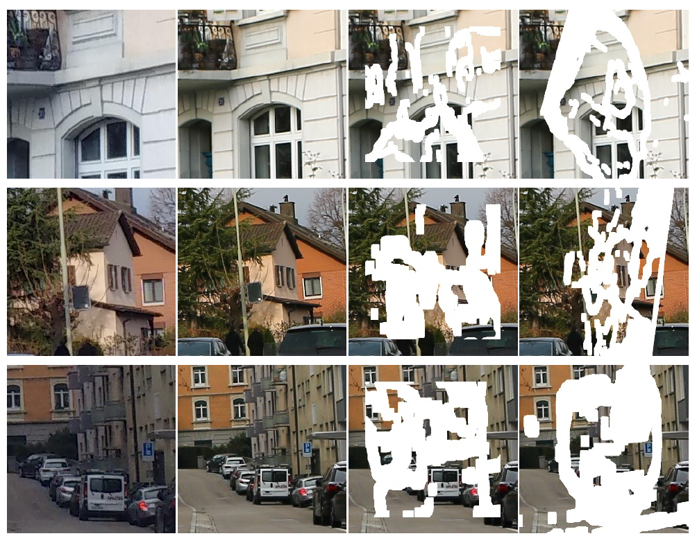

# TransRef: Multi-Scale Reference Embedding Transformer for Reference-Guided Image Inpainting


Code and datasets of paper *TransRef: Multi-Scale Reference Embedding Transformer for Reference-Guided Image Inpainting*.

> **Abstract:** *Image inpainting for completing complicated semantic environments and diverse hole patterns of corrupted images is challenging even for state-of-the-art learning-based inpainting methods trained on large-scale data. A reference image capturing the same scene of a corrupted image offers informative guidance for completing the corrupted image as it shares similar texture and structure priors to that of the holes of the corrupted image. In this work, we propose a transformer-based encoder-decoder network, named TransRef, for reference-guided image inpainting. Specifically, the guidance is conducted progressively through a reference embedding procedure, in which the referencing features are subsequently aligned and fused with the features of the corrupted image. For precise utilization of the reference features for guidance, a reference-patch alignment (Ref-PA) module is proposed to align the patch features of the reference and corrupted images and harmonize their style differences, while a reference-patch transformer (Ref-PT) module is proposed to refine the embedded reference feature. Moreover, to facilitate the research of reference-guided image restoration tasks, we construct a publicly accessible benchmark dataset containing 50K pairs of input and reference images. Both quantitative and qualitative evaluations demonstrate the efficacy of the reference information and the proposed method over the state-of-the-art methods in completing complex holes.* 


 
## Usage Instructions

### Environment
Please install Anaconda, Pytorch. For other libs, please refer to the file requirements.txt.
```
conda create -n TransRef python=3.8
conda activate TransRef
git clone https://github.com/Cameltr/TransRef.git
pip install -r requirements.txt
```
### Datasets
For reference-guided image inpainting, the similarity between the image and its reference image is of great significance to the inpainting results. However, to the best of our knowledge, there is no such publicly available dataset for this new task. In this work, expended from our previously proposed DPED10K dataset in [RGTSI](https://github.com/Cameltr/RGTSI), we construct a new dataset, namely **DPED50K**, based on the [DPED](http://people.ee.ethz.ch/~ihnatova/) dataset , which consists of real-world photos captured by three different mobile phones and one high-end reflex camera.



- Please download **DPED50K** dataset from [Baidu Netdisk](https://pan.baidu.com/s/17HmDXmStYRhAErpYjLFkJA)(password: pxl2),

- TransRef is trained and tested on the irregular mask dataset provided by [Liu et al](https://arxiv.org/abs/1804.07723). You can download publically available Irregular Mask Dataset from their [website](http://masc.cs.gmu.edu/wiki/partialconv).

- Create a folder and unzip the dataset into it, then 
 edit the path of the folder in `options/base_options.py`

## Pre-trained weight and test model

I will re-train our model and update the parameters soon

## Training and Testing
```bash
# To train on the your dataset, for example.
python train.py  --de_root=[the path of ground truth images] --mask_root=[the path of mask images] -ref_root=[the path of reference images]
```
There are many options you can specify. Please use `python train.py --help` or see the options

To log training, use `--./logs` for Tensorboard. The logs are stored at `logs/[name]`.

```bash
# To test on the your dataset, for example.
python test.py  
```
Please edit the the path of test images in `test.py` when testing on your dataset.
